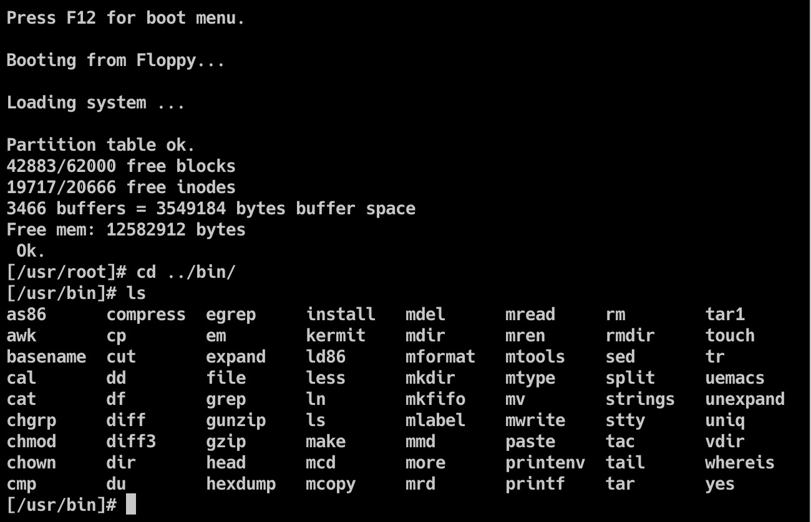

平时当我们使用`bochs`的时候，不论是在`mac`下还是在`ubuntu`下，都是用图形界面去使用`bochs`

而身为一个vim用户，让我们尝试一下让它在文本界面启动

我最初有这个想法也是看到[`linux-0.11-lab`](https://github.com/tinyclub/linux-0.11-lab#hack-linux-011-on-linux)的代码，在`make start`他们的代码之后（需要修改Makefile），我发现他们的代码可以在文本界面启动，我就非常好奇是如何实现的。

首先`bochs`是可以在文本界面启动的。

但是当我们启动模拟的时候，如果没有`X display`，会报错

所以我们要重新手动编译我们的`bochs`，让其`display_library`支持`term`，而我直接采用了[`linux-0.11-lab`](https://github.com/tinyclub/linux-0.11-lab#hack-linux-011-on-linux)的`bochs`

其次，我们需要[`linux-0.11-lab`](https://github.com/tinyclub/linux-0.11-lab#hack-linux-011-on-linux)的`bochsrc`

在我们`make start`的过程中，我们可以看到它使用了名为`bochsrc-fda.bxrc.term`的`bochsrc`

所以我们将其`bochsrc`拿过来，进行修改

这是[`linux-0.11-lab`](https://github.com/tinyclub/linux-0.11-lab#hack-linux-011-on-linux)的`bochsrc`


这是我们的`bochsrc`


最重要的就是最后一句`display_library: term`

还有就是文件中的两个文件`bootimage-0.11-hd.new`  `hdc-0.11-new.img`

需要自己准备，这两个文件提供了`Linux_0.11`的环境

将这些文件放在一起，运行

```bash
./bochs -f bochsrc
```

显示


输入6

显示


这样子就成功了，在服务器端使用`bochs`模拟`Linux-0.11`



可以看到里面有`as86`和`ld86`等工具，说明已经成功了，可以在其上做测试和模拟，不用担心环境崩溃
